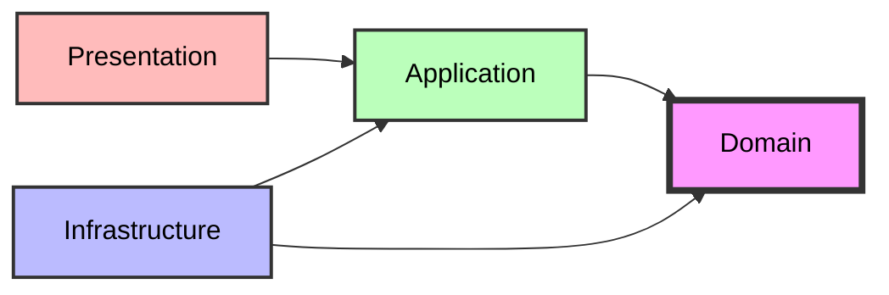

# Clean Architecture Template
A production-ready, modular .NET template implementing Clean Architecture principles, SOLID design patterns, and enterprise-level best practices. 

This template serves as a comprehensive learning resource and a solid foundation for building scalable, maintainable applications and also demonstrates **Clean Architecture** (also known as Onion Architecture or Hexagonal Architecture) principles in a real-world .NET application. It's designed to be:

- ✅ **Production-Ready**: Includes error handling, logging, validation, and security
- ✅ **Modular**: Each feature is self-contained and can be used independently
- ✅ **Testable**: High test coverage with unit, integration, and e2e tests
- ✅ **Scalable**: Designed to handle growth in complexity and team size
- ✅ **Educational**: Each component demonstrates specific OOP/System Design concepts

### 🔄 Dependency Flow

